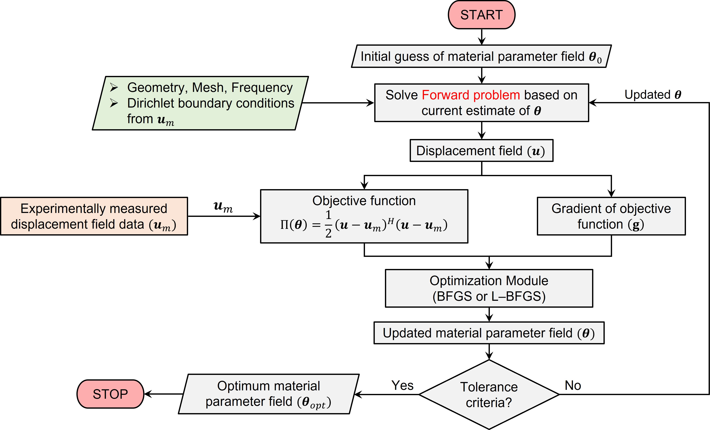

<h1 align="center">MatNLI: An Open-source MATLAB-based solver for the Non-linear Inversion in Elastography <a href="https://www.sciencedirect.com/" class="button big">[Paper]</a></h1>

#### **Data and codes for paper: MatNLI: An Open-source MATLAB-based solver for the Non-linear Inversion in Elastography**

The present study demonstrate a parallel MATLAB implementation of an efficient non-linear inversion algorithm based on the finite element method. The framework is developed for different isotropic and anisotropic material models, viz., linear elastic and viscoelastic materials in the regime of compressibility and nearly incompressibility. The FEM based non-linear inversion can be utilized for extracting complex physics of the materials irrespective of the engineering domain. The repository currently contains the data and sample codes for different case studies presented in the paper and their respective MATLAB implementation.




> 

# Installation
To run the inversion for a particular type of material model, change the current MATLAB directory to that folder and run file "InverseNLI.m".

# Requirements:
To run the algorithm, "***Optimization Toolbox***" and "***Parallel Computing Toolbox***" are required in MATLAB. Ensure that it is included in your MATLAB installation.


# Citing
This repository has been developed as part of the following paper (citation given below). We would appreciate it if you would please cite the following paper if you found the library useful for your work.

```
@article{awasthi2023NLI,
    title = {MatNLI: An Open-source MATLAB-based solver for the Non-linear Inversion in Elastography},
    author = {Abhilash Awasthi, Moirangthem Dinachandra, Puneet Mahajan, Ashish Suri, and Sitikantha Roy},
    journal = {Advances in Engineering Software},
    pages = {},
    year = {2023},
    issn = {},
    doi = {https://doi.org/},
    url = {https://www.sciencedirect.com/science/article/}
}
```
